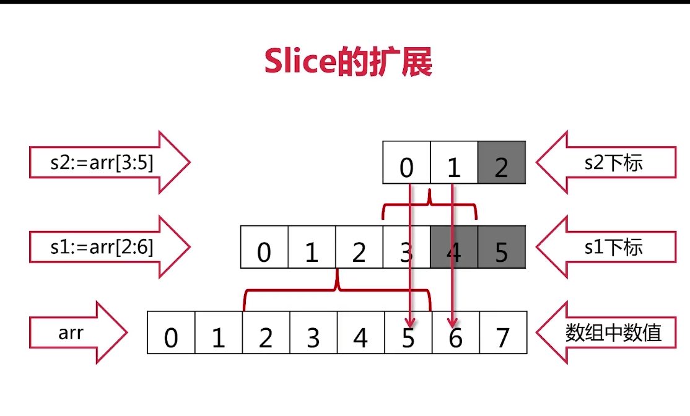

# 20210621

## 切片 slicen

```go

package main

import "fmt"

func main() {
	arry := [...]int{0, 1, 2, 3, 4, 5, 6, 7}
	fmt.Println(arry)
	s1 := arry[2:6]
	s2 := s1[3:5]
	fmt.Println(s2)
}

```


---




---

---
